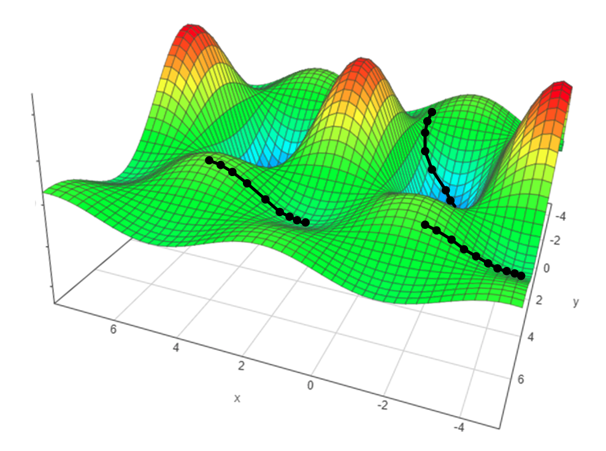
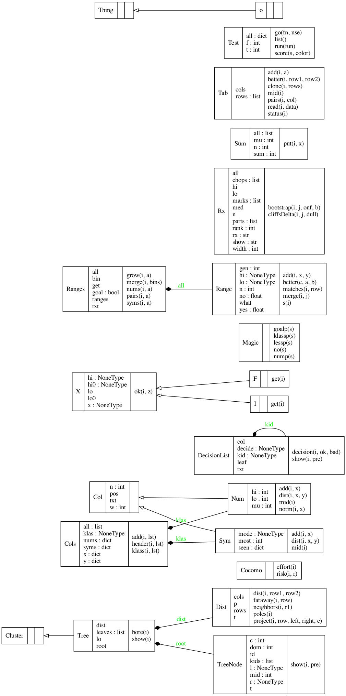

<h1 xalign=center> BnBAD (break 'n bad):<br>fast, explicable, multi-objective reasoning</h1>

<p xalign=center>
<a href="https://doi.org/10.5281/zenodo.3947026"></a> 
<a href="https://github.com/timm/bnbad/blob/master/LICENSE.md"></a> 

<a href="http://menzies.us/bnbad"></a>
</p>


<p xalign=center>


<a href="https://flake8.pycqa.org/en/latest/user/error-codes.html"></a>
<a href="https://pep8.readthedocs.io/en/release-1.7.x/intro.html#error-codes"></a>
<a href="https://travis-ci.org/github/timm/bnbad"></a> 
</p>



BnBAD is a multi-objective optimizer
that reasons by:

1. breaking up problems into regions of `bad` and
`better`;
2.  then looks for ways on how to jump between those regions.

```
:-------:  
| Ba    | Bad <----.  planning= (better - bad)
|    56 |          |  monitor = (bad - better)
:-------:------:   |  
        | B    |   v  
        |    5 | Better  
        :------:
```


BnBAD might be a useful choice when:

- users have to trade-off competing goals, 
- succinct explanations are needed about what the system is doing,
- those explanations have to include ranges within which it is safe
  to change the system, 
- guidance is needed for how to improve things
  (or know what might make things worse); 
- thing being studied is constantly changing so:
   - we have to perpetually check if the current system is still trustworthy
   - and, if not, we need to update our models

## Install

Download the repo or the zip from http://github.com/timm/bnbad

In the same directory as the `setup.py` file....

Install pypy3:

    brew install pypy3      # mac os/x
    sudo apt install pypy3  # unix

Install support packages into the pypy3 space:

    pip3      install termcolor rerun
    pip_pypy3 install termcolor rerun # optional.. if you want speed

Install `bnbad` using `setup.py`:

    python3 setup.py install
    pypy3   setup.py install # optional.. if you want speed

## Technical Notes: 

- Examples are clustered in goal
  space and the `better` cluster is the one that dominates all the
  other `bad` clusters.
- `bad` and `better` are score via [Zitler's continuous domination predicate](docs/index.html#bnbad.Tab.better)
- Numerics are then broken up into just a few ranges
  using a bottom-up merging process
  guided by the ratio of `better` to `bad`  in each range. 
- These numeric ranges,
  and the symbolic ranges are then used to build a succinct decision list
  that can explain what constitutes `better` behavior. 
  This decision list has many uses:
    - _Planning_: The deltas in the conditions that lead to the leaves of that decision list can
      offer guidance on how to change
      `bad` to `better`. 
    - _Monitoring_: The opposite of planning. Learn what can change `better`
      to `bad`, then watch out for those things.
    - _Anomaly detection and incremental certification:_ 
     The current decision list can be trusted as long as new examples 
     fall close to the old examples seen in the leaves of the decision list.
    - _Stream mining_: Stop learning while the anomaly detector is not
      triggering. Track the anomalies seen each branch of the decision list.
      Update just the branches that get too many anomalies (if that ever happens).

## Example

Here, we show how a clustered-based analysis
can dramatically simpligy multi-objective reasoning.

Here's a data set where the first line names the columns. In that line "`$`"
denotes numerics and "`>`" and "`<`" denotes goals we want to maximize or
minimize (respectively).  Hence:

-  _$displacement_ and _$horsepower_ and _$model_ are numeric;
- _cylinders_ and _origin_ are symbolic;
- We want to mimimize `_weight_` and maximize `_acceleration_`

```txt
cylinders, $displacement, $horsepower, <weight, >acceleration, $model,  origin, >mpg
8,         304,           193,         4732,    18.5,          70,      1,      10
8,         360,           215,         4615,    14,            70,      1,      10
8,         307,           200,         4376,    15,            70,      1,      10
8,         318,           210,         4382,    13.5,          70,      1,      10
...
300+ more rows
```

Without BnBAD, using classical methods, we might 
(a) learn one equation for each goal; (b) then use some multi-objective
optimizer to explore trade-offs between those equations.

Here is what linear regression tells us:

```txt
mpg =         -0.6599 * cylinders +
              -0.016  * displacement +
              -0.0627 * horsepower +
               0.6251 * model +
               1.2385 * origin + -12.3701

acceleration = 0.009  * displacement +
              -0.0712 * horsepower + 21.2507

weight =      62.3829 * cylinders +
               5.128  * displacement +
               4.3461 * horsepower +
              13.836  * model +
             -49.7531 * origin + 211.281 
```
But with BnBAD, we can learn a much, much simpler model. First, we recursively
cluster the data based on the three goal scores.  For each leaf,
we write down the mean goal scores. For example, for the first leaf 
(labelled `[0]`):

- <weight, >acceleration, >!mpg
- is 3452.97, 15.04, 20

```txt
398
|  211
|  |  121
|  |  |  57
|  |  |  |  31 [0] {3452.97, 15.04, 20.00}** 26 %
|  |  |  |  26 [1] {3506.65, 18.31, 20.00}*** 33 %
|  |  |  64
|  |  |  |  27 [2] {2637.00, 15.10, 20.00}**** 46 %
|  |  |  |  37 [3] {2979.89, 16.51, 20.00}**** 40 %
|  |  90
|  |  |  48
|  |  |  |  21 [4] {4181.14, 14.19, 11.90}* 13 %
|  |  |  |  27 [5] {3838.85, 12.71, 19.26}** 20 %
|  |  |  42
|  |  |  |  21 [6] {4180.90, 11.54, 13.81} 6 %
|  |  |  |  21 [7] {4665.00, 11.88, 10.00} 0 %
|  187
|  |  104
|  |  |  51
|  |  |  |  30 [8] {2343.73, 16.46, 29.33}****** 66 %
|  |  |  |  21 [9] {2514.90, 19.63, 27.14}******* 73 %
|  |  |  53
|  |  |  |  18 [10] {2628.83, 15.37, 24.44}***** 53 %
|  |  |  |  35 [11] {2485.60, 14.44, 30.00}****** 60 %
|  |  83
|  |  |  49
|  |  |  |  29 [12] {2045.55, 16.74, 30.00}******** 80 %
|  |  |  |  20 [13] {1977.90, 17.44, 31.00}******** 86 %
|  |  |  34 [14] {2030.09, 17.05, 40.29}********* 93 %
```

The last leaf, (labelled `[14]`) is "best" since it
dominates 93% of the other nodes
(where "dominates" is a measure of "better" across the goals).

BnBAD reports a decision list that hows how to select this best
node from everything else:

```txt
% best rule
if cylinders  in  4 .. 4 then {2270.90, 16.66, 29.70} 67
else {3724.51, 14.17, 17.14} 63
```

Another thing we do is ask what take us from the best to worst leaf  (labelled `[7]`).
That decision list is:

```txt
if cylinders  in  8 .. 8 then {4311.71, 11.57, 12.29} 35
else {2267.46, 16.79, 31.92} 26
```

So what is being said here is that:

- Eight cylinder cars are heavier and slower. 
- Four cylinder cars and lighter and more nimble. 

Obvious, right? But here's the important thing-- the number of cylinders effects everything else. That effect is very clear from the decision lists,
but that is not clear from the regression equations.

## Classes

For information on the following design, [read the docs](http://menzies.us/bnbad).


